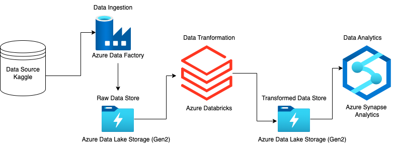
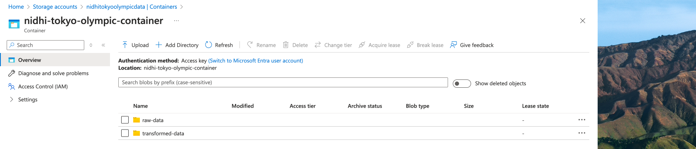
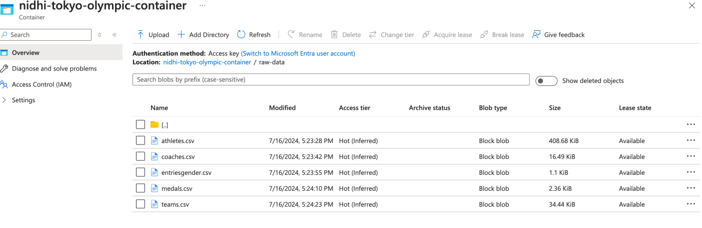
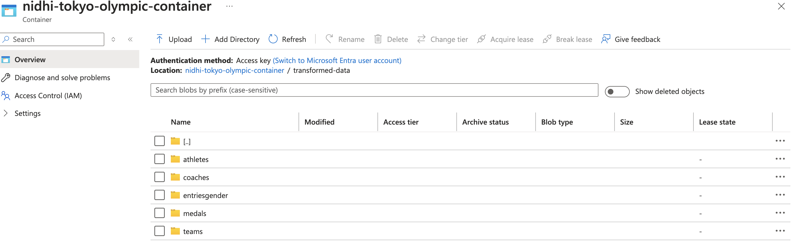
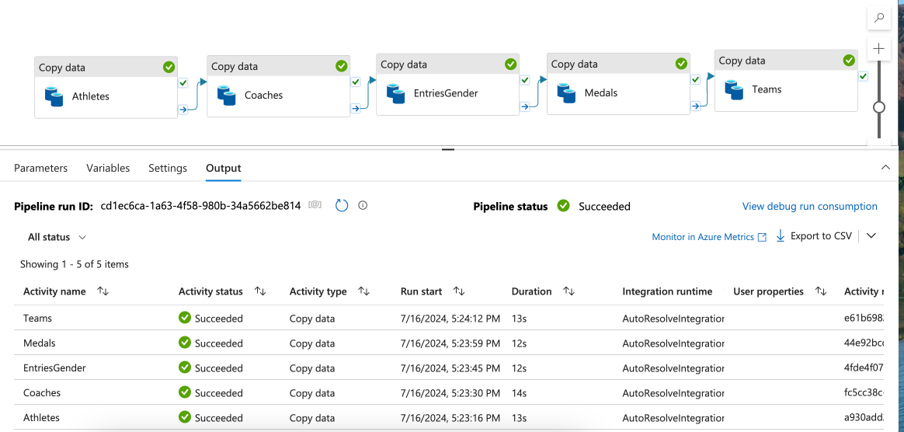
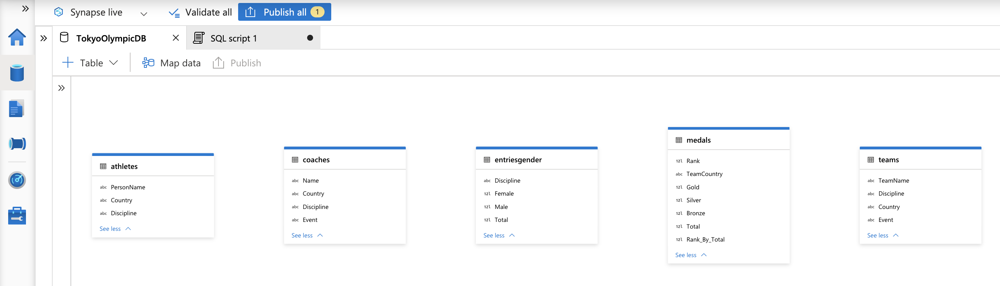

# nidhi-tokyo-olympic-azure-etl-project
This project is developed to <b>explore and learn various Azure services</b>. This project does not aim to demonstrate heavy analytical skills but rather learnings on Microsoft Azure services. 
This repo consists of small codes and major screenshots that pulls data from raw Tokyo Olympic files from kaggle & dumps the data onto Azure Storage Containers. Very basic transformations are then done on that raw data. The transformed data is then partitioned and stored in Azure Storage Container. 

Please read the steps to see what actions have been taken to execute this project. 

### Tech Stack Involved
* Azure Storage Account (Data Storage)
* Azure Data Factory (Data Ingestion)
* Azure App Registration (Service Integration)
* Azure Databricks (Data Transformation)
* Pyspark (Data Transformation)
* Azure Synapse Analytics (Data Analytics)
* SQL(Data Analytics)

### Architecture Diagram 

### Steps Involved

* Created a Microsoft Azure Free account
* Created Azure Storage account resource
* Created container inside Azure Storage Account to store raw and transformed data.
* Created Azure Data Factory Resource
* Created a pipeline via Azure Data Factory "Copy" tool to extract data from github and dump it into Azure Data Lake Storage (gen2) conatiner
* Created Azure Databricks resource
* Created Azure App Registration to Connect Azure Databricks to Azure Storage Account to access raw data
* This App Registration gives Client_id, Client_Secret & tenant_id keys.
* Gave required permissions to the App to access the raw data
* Created Azure Databricks notebook
* Utilized PySpark to access the raw data from Storage account through the keys mentioned above and wrote the transformation code.
* Dumped the transformed data into the Azure Storage container in "transformed"  folder
* Used Azure Synapse Analytics to Load the transformed data and perform SQL analytics.

### Challenges/Learnings
Similar to others, I encountered several challenges and learnt a lot throughout the project. Below, I've outlined these to provide foresight and preparation for future endeavors.

* <u><b>Accessing Data From Github</b></u> - Github does not generate the url for raw data by itself when we click the raw button on any file. So had to figure out on what is the correct HTTP url to  be used to access the raw data.

* <u><b>Azure Resource Groups</b></u> - Before access any Azure service, Azure requires you to create a "resource group" for that service. This is because Microsoft Azure focuses more on "Organization". Resource groups helps us manage and organize related resources (like virtual machines, storage accounts, and databases) in a single container. This logical grouping makes it easier to manage, monitor, and apply policies to related resources as a unit.

* <u><b>Different Microsoft Services</b></u> - Microsoft Azure services are designed to be interconnected and work seamlessly together, allowing you to build comprehensive and integrated solutions.

     * <u><b>Azure Data Lake Storage Gen2 (ADLS Gen2)</b></u> - ADLS is an advanced and scalable data storage service in Microsoft Azure designed specifically for big data analytics. It combines the scalability and cost benefits of Azure Blob Storage with the file system capabilities and performance required for big data workloads.
     
     
                
         
     * <u><b>Azure Data Factory</b></u> - It allows us to create, schedule, and orchestrate data workflows and pipelines that can move and transform data across various data stores such as Azure SQL Database, Azure Data Lake, and third-party services.

     
     
     * <u><b>Azure Synapse Analytics</b></u> - It integrates with various data sources, providing a unified analytics platform that brings together big data and data warehousing. We can integrate, transform and perform analytics even using this one Service. 

     